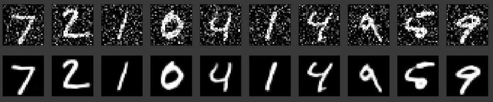
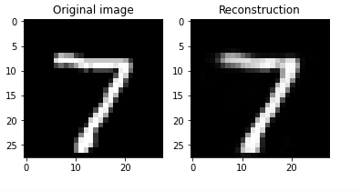
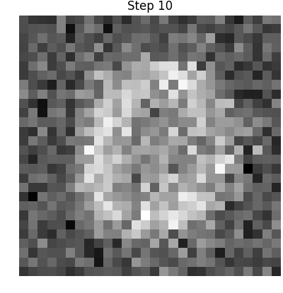

<h1 align="center">Application-of-Convolutional-AutoEncoders</h1>
<a href="#">
  <div align="center">
    
  </div>
</a>

## Image Denoising with Deep Convolutional AutoEncoder
<a href="#">
  <div align="center">
    
  </div>
</a> 

## Image Reconstruction with Deep AutoEncoder
<a href="#">
  <div align="center">
    
  </div>
</a>

## Visualizing Reconstruction Process


## Run it now

<a href="https://colab.research.google.com/drive/16CpcQR8YaGa4MtryfDsVEQqAFJFKcxKa" target="_parent">
    
</a>

## Running Locally
1.Installing requirements and dependencies
```
git clone https://github.com/saadhaxxan/Visualizing-Class-Activation-Maps-for-CNN.git
cd Visualizing-Class-Activation-Maps-for-CNN
pip install -r requirements.txt
```
2.Running the Script
```
python class_activation_maps_resnet50.py
```
## Author
You can get in touch with me on my LinkedIn Profile:

#### Saad Hassan
[](https://www.linkedin.com/in/saadhaxxan)

You can also follow my GitHub Profile to stay updated about my latest projects: [](https://github.com/saadhaxxan)

If you liked the repo then kindly support it by giving it a star ⭐!
